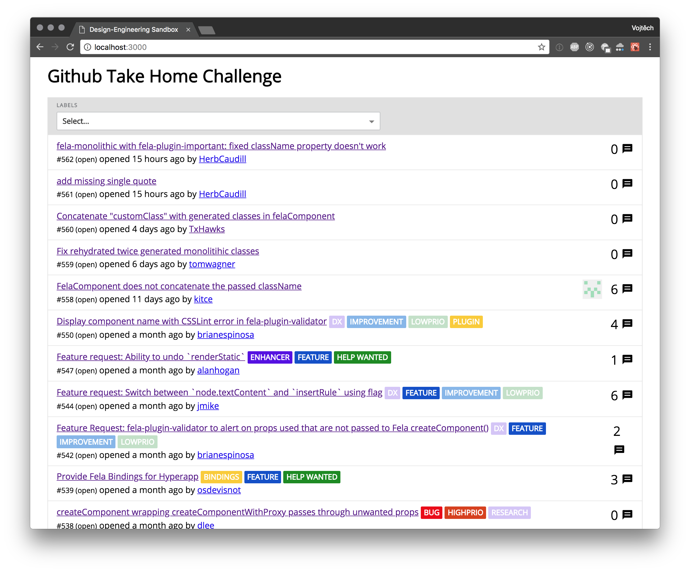

# Github Take Home Test



## Installation

It assumes you have the latest node and yarn installed.

```
git clone https://github.com/tajo/sandbox
cd sandbox
git checkout github-issues
yarn install
yarn dev
open http://localhost:3000
```
